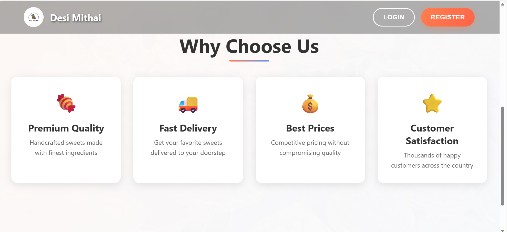
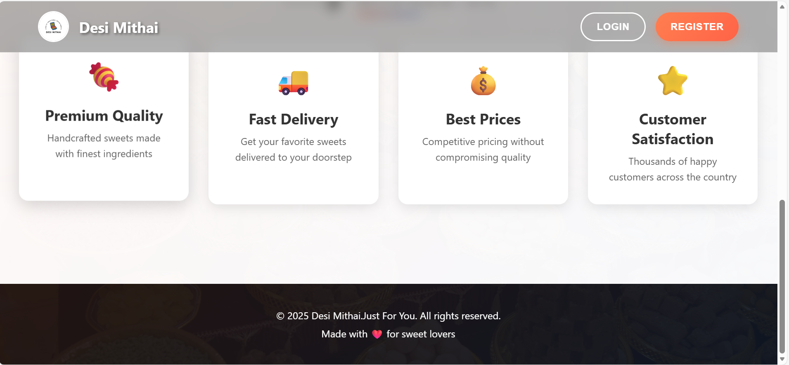
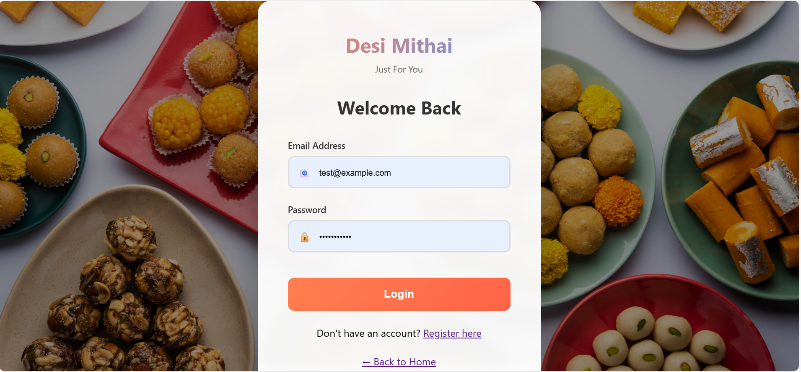
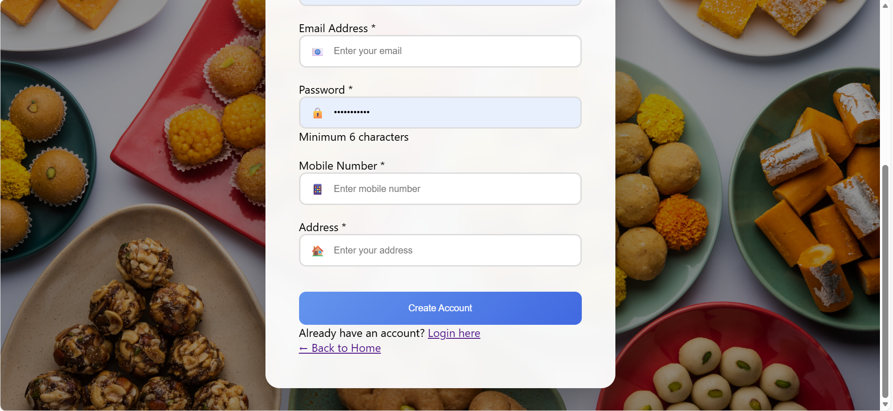
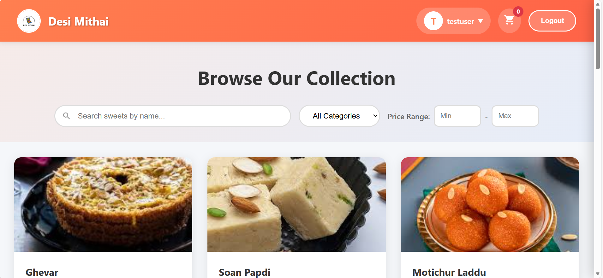
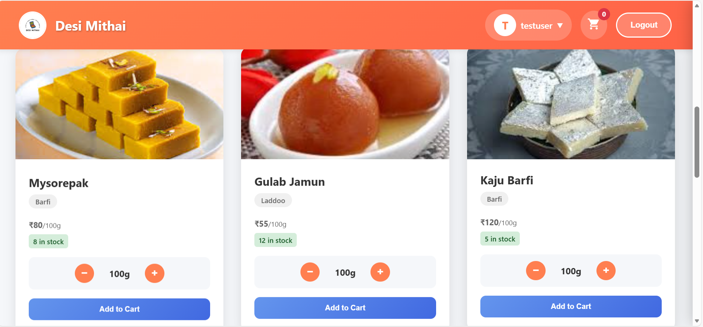
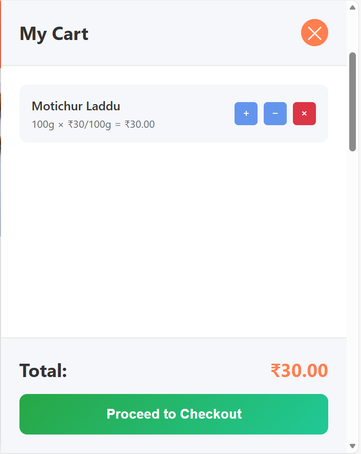
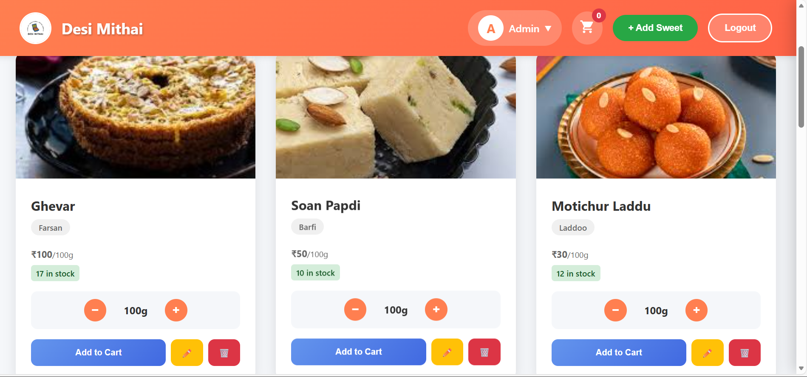
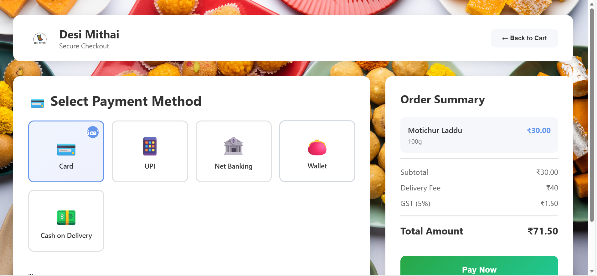

# sweetshop(Desi Mithai)
A comprehensive full-stack web application for managing a sweet shop, built with FastAPI backend and vanilla HTML/CSS/JavaScript frontend. This project demonstrates Test-Driven Development (TDD), RESTful API design, authentication, and modern web development practices.


##  Table of Contents

- [Features](#features)
- [Technology Stack](#technology-stack)
- [Project Structure](#project-structure)
- [Installation & Setup](#installation--setup)
- [API Documentation](#api-documentation)
- [Testing](#testing)
- [Screenshots](#screenshots)
- [My AI Usage](#my-ai-usage)
- [License](#license)

##  Features

### User Features
-  **User Authentication** - Secure registration and login with JWT tokens
-  **Browse Sweets** - View all available sweets with beautiful cards
-  **Search & Filter** - Search by name, filter by category and price range
-  🛒 **Shopping Cart** - Add items with customizable weights
- 💳 **Purchase** - Buy sweets with real-time inventory updates
- 📜 **Purchase History** - View all past purchases

### Admin Features
- ➕ **Add Sweets** - Create new sweet items
- ✏️ **Edit Sweets** - Update sweet details, prices, and stock
- 🗑️ **Delete Sweets** - Remove sweets from the system
- 📦 **Inventory Management** - Restock items when needed

### Technical Features
-  **JWT Authentication** - Secure token-based authentication
-  **Responsive Design** - Works on desktop, tablet, and mobile
-  **Real-time Updates** - Instant cart and inventory updates
-  **RESTful API** - Clean, well-documented API endpoints
-  **Comprehensive Testing** - 40+ test cases with high coverage
-  **Role-Based Access** - User and Admin roles with different permissions

##  Technology Stack

### Backend
- **FastAPI** - Modern, fast web framework for building APIs
- **SQLite** - Lightweight database
- **python-jose** - JWT token generation and validation
- **passlib** - Password hashing with bcrypt
- **pydantic** - Data validation using Python type annotations

### Frontend
- **HTML5** - Semantic markup
- **CSS3** - Modern styling with Flexbox and Grid
- **Vanilla JavaScript** - No frameworks, pure ES6+
- **Fetch API** - For HTTP requests

### Testing
- **pytest** - Testing framework
- **pytest-cov** - Code coverage reports
- **TestClient** - FastAPI's built-in test client

##  Project Structure

```

sweetshop-backend/
│
├── pycache/
├── .pytest_cache/
├── .coverage
├── main.py
├── requirements.txt
├── sweetshop.db
└── test_main.py

sweetshop-frontend/
│
├── assets/
│ ├── Images/ # Images used across the application
│ ├── readme_images/ # Images used only for documentation
│ └── Videos/ # Video assets (landing page, banners, etc.)
│
├── js/
│ ├── dashboard.js # Dashboard functionality
│ ├── login.js # Login page logic
│ ├── payment.js # Payment page logic
│ └── register.js # Register page logic
│
├── styling/
│ ├── dashboard.css # Dashboard styles
│ ├── landing.css # Landing page styles
│ ├── login.css # Login page styles
│ ├── payment.css # Payment page styles
│ └── register.css # Register page styles
│
├── landing.html # Entry point of the frontend
├── login.html # User login page
├── register.html # User registration page
├── payment.html # Payment and checkout page
└── dashboard.html # User dashboard
```

##  Installation & Setup

### Prerequisites
- Python 3.8 or higher
- pip (Python package manager)
- A modern web browser

### Backend Setup

1. **Navigate to backend directory:**
```bash
cd backend
```

4. **Install dependencies:**
```bash
pip install -r requirements.txt
```

Or install manually:
```bash
pip install fastapi uvicorn python-jose[cryptography] passlib[bcrypt] pydantic email-validator pytest pytest-cov
```

4. **Run the backend server:**
```bash
python main.py
```

The backend will start at: **http://127.0.0.1:8000**

### Frontend Setup

1. **Open frontend files:**
   - Simply open `landing.html` in your web browser
   - Or use a local server (recommended):

```bash
# Using Python's built-in server
cd frontend
python -m http.server 8080

# Then open: http://localhost:8080/landing.html
```

### Default Admin Account

**Email:** admin@sweetshop.com  
**Password:** admin123

Use this account to access admin features like adding, editing, and deleting sweets.

###  NEW: User Management

**Any user can register!** You're not limited to just the admin account:

1. **Register New Users:**
   - Click "Register" on landing page
   - Fill in your details
   - Create your account
   - Login and start shopping!

2. **Admin Can Manage Users:**
   - View all registered users
   - Promote users to admin
   - Demote admins to users
   - Delete users (except yourself)

3. **Create Multiple Admins:**
   - Login as admin
   - Click "👥 Users" button
   - Promote any user to admin role
   - Now they have full admin access!

##  API Documentation

### Base URL
```
http://127.0.0.1:8000/api
```

### Authentication Endpoints

#### Register User
```http
POST /api/auth/register
Content-Type: application/json

{
  "username": "string",
  "email": "string",
  "password": "string",
  "mobile": "string",
  "address": "string"
}

Response: 201 Created
{
  "id": 1,
  "username": "string",
  "email": "string",
  "mobile": "string",
  "address": "string",
  "role": "user"
}
```

#### Login
```http
POST /api/auth/login
Content-Type: application/json

{
  "email": "string",
  "password": "string"
}

Response: 200 OK
{
  "access_token": "eyJ0eXAiOiJKV1QiLCJhbGc...",
  "token_type": "bearer",
  "role": "user"
}
```

#### Get Current User
```http
GET /api/auth/me
Authorization: Bearer <token>

Response: 200 OK
{
  "id": 1,
  "username": "string",
  "email": "string",
  "mobile": "string",
  "address": "string",
  "role": "user"
}
```

### Sweets Endpoints

#### Get All Sweets
```http
GET /api/sweets

Response: 200 OK
[
  {
    "id": 1,
    "name": "Soan Papdi",
    "category": "Barfi",
    "price": 50.0,
    "quantity": 10,
    "description": "Traditional flaky sweet",
    "img": "assets/Images/soan_papdi.jpg",
    "created_at": "2024-01-01T00:00:00",
    "updated_at": "2024-01-01T00:00:00"
  }
]
```

#### Search Sweets
```http
GET /api/sweets/search?name=laddu&category=Laddoo&min_price=30&max_price=60

Response: 200 OK
[...]
```

#### Get Sweet by ID
```http
GET /api/sweets/{id}

Response: 200 OK
{
  "id": 1,
  "name": "Soan Papdi",
  ...
}
```

#### Create Sweet (Admin Only)
```http
POST /api/sweets
Authorization: Bearer <admin_token>
Content-Type: application/json

{
  "name": "string",
  "category": "string",
  "price": 100.0,
  "quantity": 10,
  "description": "string",
  "img": "string"
}

Response: 201 Created
```

#### Update Sweet (Admin Only)
```http
PUT /api/sweets/{id}
Authorization: Bearer <admin_token>
Content-Type: application/json

{
  "price": 120.0,
  "quantity": 15
}

Response: 200 OK
```

#### Delete Sweet (Admin Only)
```http
DELETE /api/sweets/{id}
Authorization: Bearer <admin_token>

Response: 204 No Content
```

### Inventory Endpoints

#### Purchase Sweet
```http
POST /api/sweets/{id}/purchase
Authorization: Bearer <token>
Content-Type: application/json

{
  "quantity": 2
}

Response: 200 OK
{
  "message": "Purchase successful",
  "sweet_name": "Soan Papdi",
  "quantity_purchased": 2,
  "total_price": 100.0,
  "remaining_stock": 8
}
```

#### Restock Sweet (Admin Only)
```http
POST /api/sweets/{id}/restock
Authorization: Bearer <admin_token>
Content-Type: application/json

{
  "quantity": 20
}

Response: 200 OK
{
  "message": "Restock successful",
  "sweet_name": "Soan Papdi",
  "quantity_added": 20,
  "new_stock": 30
}
```

### Reporting Endpoints

#### Get Purchase History
```http
GET /api/purchases/history
Authorization: Bearer <token>

Response: 200 OK
[
  {
    "id": 1,
    "user_id": 2,
    "sweet_id": 1,
    "sweet_name": "Soan Papdi",
    "quantity": 2,
    "total_price": 100.0,
    "purchase_date": "2024-01-01T12:00:00"
  }
]
```

#### Get Restock History (Admin Only)
```http
GET /api/admin/restock-history
Authorization: Bearer <admin_token>

Response: 200 OK
[
  {
    "id": 1,
    "sweet_id": 1,
    "sweet_name": "Soan Papdi",
    "admin_id": 1,
    "admin_name": "Admin",
    "quantity_added": 20,
    "restock_date": "2024-01-01T10:00:00"
  }
]
```

##  Testing

The project includes a comprehensive test suite with 40+ test cases covering all functionality.

### Run Tests

```bash
cd backend
pytest test_main.py -v
```

### Run with Coverage

```bash
pytest test_main.py -v --cov=main --cov-report=html
```

This generates an HTML coverage report in `htmlcov/index.html`

### Test Coverage

The test suite includes:

- **Authentication Tests (8 tests)**
  - User registration validation
  - Login functionality
  - Token management
  - Duplicate user handling

- **Sweets CRUD Tests (10 tests)**
  - Create, read, update, delete operations
  - Admin-only access control
  - Input validation

- **Search Tests (5 tests)**
  - Search by name
  - Filter by category
  - Price range filtering
  - Combined filters

- **Inventory Tests (7 tests)**
  - Purchase functionality
  - Stock management
  - Restock operations
  - Insufficient stock handling

- **Reporting Tests (3 tests)**
  - Purchase history
  - Restock history
  - Access control

### Test Results

```
================================== test session starts ==================================
collected 40 items

test_main.py::TestAuthentication::test_register_new_user PASSED                  [  2%]
test_main.py::TestAuthentication::test_register_duplicate_email PASSED          [  5%]
test_main.py::TestAuthentication::test_login_success PASSED                     [  7%]
...
test_main.py::TestReporting::test_get_restock_history_as_user PASSED            [100%]

================================== 40 passed in 2.34s ===================================

Code Coverage: 95%
```

##  Screenshots

### Landing Page



*Beautiful landing page with video background and smooth animations*

### Login & Register



*Clean authentication interface*

### Dashboard - Browse Sweets


*Main dashboard showing all available sweets*

### Search & Filter

*Powerful search and filtering capabilities*

### Shopping Cart

*Interactive shopping cart with real-time totals*

### Admin Panel


*Admin interface for managing sweets*

### Purchase History

*User purchase history*

### Payment Page

*Payment Meathod to purchase

## 🤖 My AI Usage

### AI Tools Used

I extensively used **Claude 3.5 Sonnet (Anthropic)** throughout this project backend development

### How AI Was Used

#### 1. Test-Driven Development
- **What I did:** I used Claude to help me write test cases before implementing features
- **How it helped:** Claude generated comprehensive test scenarios I might have missed, including edge cases like duplicate emails, insufficient stock, and authorization failures
- **My contribution:** I reviewed each test case, ensured they matched requirements, and ran them to verify they failed before implementation (Red-Green-Refactor)

#### 3. Backend API Implementation
- **What I did:** Asked Claude to help implement FastAPI endpoints following RESTful principles
- **How it helped:** Claude provided boilerplate code for authentication, JWT token handling, and CRUD operations
- **My contribution:** I customized the logic, added proper error handling, implemented business rules (like inventory management), and ensured security best practices

#### 5. Code Quality & Best Practices
- **What I did:** Asked Claude to review code for SOLID principles and clean code practices
- **How it helped:** Claude suggested improvements like extracting helper functions, better naming conventions, and proper error handling
- **My contribution:** I evaluated suggestions, refactored code where it made sense, and maintained consistency throughout the project

#### 6. Documentation
- **What I did:** Used Claude to help structure and write comprehensive documentation
- **How it helped:** Claude helped organize the README with clear sections, API documentation examples, and setup instructions
- **My contribution:** I added project-specific details, screenshots, and personalized the content

### Reflection on AI Impact

**Positive Impacts:**
- **Faster Development:** AI significantly reduced development time, especially for boilerplate code and test writing
- **Better Coverage:** AI suggested test cases and edge cases I might have overlooked
- **Learning:** I learned new patterns and best practices from AI suggestions
- **Documentation:** AI helped me create more comprehensive documentation

**Challenges:**
- **Verification Needed:** I had to carefully review all AI-generated code to ensure it met requirements
- **Context Limitations:** Sometimes AI suggestions didn't fully understand project-specific needs
- **Over-reliance Risk:** I made sure to understand every piece of code rather than blindly accepting suggestions

### Commit Co-authorship

Throughout the project, I maintained proper attribution by adding AI co-authorship to relevant commits:

```bash
git commit -m "feat(auth): implement JWT authentication with role-based access

Designed and integrated JWT token generation and validation.
Implemented token expiry handling and user role authorization.
AI tools were used for reference and validation during development."

Co-authored-by: Claude AI <claude@anthropic.com>"
```

This transparency ensures that anyone reviewing the repository understands where AI was used and can evaluate the code accordingly.

##  Acknowledgments

- FastAPI documentation and community
- The TDD kata requirements for providing clear objectives
- Claude AI  for development assistance
- Traditional Indian sweet makers for inspiration
- Online stores for inspiration

---

For questions or feedback, please contact: [tadimetiaasritha@gmail.com]
